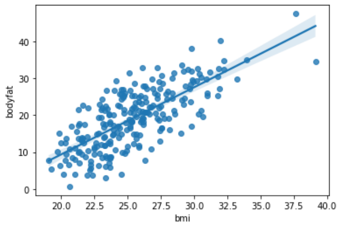

```{r setup, include=FALSE}
library(knitr)
opts_chunk$set(tidy.opts=list(width.cutoff=68),tidy=TRUE)
knitr::opts_chunk$set(echo = TRUE,tidy=TRUE,message=FALSE,warning=FALSE,strip.white=TRUE,prompt=FALSE,
                      cache=TRUE, size="scriptsize")
whichformat="latex"
```

--- 


# Plan for i dag

$~$

* Hvem er vi?

* Statistisk læring og data science

* De tre temaene i modulen: 
  + regresjon 
  + klassifikasjon og
  + klyngeananlyse 

* Læringsressurser og pensum

* Prosjektoppgaven og Blackboard-informasjon

* Tema: regresjon - med enkel lineær regresjon
 


---

# Læringsmål (av modulen)

Etter du har gjennomført denne modulen skal du kunne:

* forstå når du kan bruke regresjon, klassifikasjon og
klyngeananlyse til å løse et ingeniørproblem

* kunne gjennomføre multippel lineær regresjon på et
datasett

* bruke logistisk regresjon og nærmeste nabo for å utføre
en klassifikasjonsoppgave

* bruke hierarkisk og $k$-means klyngeanalyse på et
datasett, forstå begrepet avstandsmål

* og kunne kommunisere resultatene fra regresjon/
klassifikasjon/klyngeanalyse til medstudenter og
ingeniører

*  bli en kritisk leser av resultater fra statistikk/maskinlæring/
statistisk læring/data science/kunstig intelligens når disse
rapporteres i media, og forstå om resultatene er
realistiske ut fra informasjonen som gis

*  kunne besvare prosjektoppgaven på en god måte!  

---

# Hva er statistisk læring og data science?

Todo

---

# Prosjektoppgaven

$~$

* Vi ser hvor informasjonen ligger på Blackboard og hvordan melde seg på gruppe.

$~$

* Vi ser på prosjektoppgaven på https://s.ntnu.no/isthub.

--- 

# Læringsmål (i dag)

$~$

* Du kan lage en modell for å  forstå sammenhengen mellom en respons og
en eller flere forklaringsvariabler.

$~$

* Du kan lage en modell for å predikere en respons
fra en eller flere forklaringsvariabler.


---

# Læringsressurser

\vspace{2mm}
Alle ressurser er tilgjengelig her:

https://wiki.math.ntnu.no/istx1003/2021h/start

$~$

Tema Regresjon:

\vspace{2mm}

* **Kompendium**: Regresjon (pdf og html, by Mette Langaas)

* **Korte videoer**: (by Mette Langaas)
  * Multippel lineær regresjon: introduksjon (14:07 min)
  * Multippel lineær regresjon: analyse av et datasett (15:20 min)


* Denne forelesningen 

* **Disse slides** med notater

---

 
# Regresjon -- motiverende eksempel 
\centering\tiny(Veiledet læring - vi kjenner responsen)

\vspace{2mm}

\flushleft
\normalsize


* Kropssfett er en viktig indikator for overvekt, men vanskelig å måle.

\vspace{2mm}
**Spørsmål:**  Hvilke faktorer tillater præsis estimering av kroppsfettet?  


\vspace{2mm}
Vi undersøker 243 mannlige deltakere. Kroppsfett (%), BMI og andre forklaringsvariabler ble målet. Kryssplott:


```{r motivating, echo=FALSE, fig.width=8, fig.height=3,fig.align = "center",out.width='100%'}
library(dplyr)
library(ggplot2)
path <- "data/"
d.bodyfat <- read.table(paste(path,"bodyfat.clean.txt",sep=""),header=T)
d.bodyfat <- d.bodyfat[,c("bodyfat","age","gewicht","hoehe","bmi","neck","abdomen","hip")]
names(d.bodyfat) <- c("bodyfat","age","weight","height","bmi","neck","abdomen","hip")

par(mfrow=c(1,4))
plot(bodyfat ~ bmi,d.bodyfat,xlab="bmi", ylab="bodyfat (y)")
plot(bodyfat ~ age,d.bodyfat,xlab="age", ylab="bodyfat (y)")
plot(bodyfat ~ neck,d.bodyfat,xlab="neck", ylab="bodyfat (y)")
plot(bodyfat ~ hip,d.bodyfat,xlab="hip", ylab="bodyfat (y)")
```
 
---

For en model for funker god for prediksjon trenger vi _multippel linear regresjon_. Men vi begynner med _enkel linear regresjon_ (bare en forklaringsvariabel):
 

```{r motivating2, echo=FALSE, fig.width=6, fig.height=5,fig.align = "center",out.width='70%'}
ggplot(d.bodyfat,aes(x=bmi,y=bodyfat)) + geom_point() + theme_bw() + ylab("body fat (%)")
```

---
 
# Enkel linear regresjon

$~$

* En kontinuerlig respons variabel $Y$

* Bare _en forklaringsvariabel_ $x_1$ 

* Relasjon mellom $Y$ og $x_1$ er antatt å være _linear_. 

\vspace{6mm}
Hvis den lineare relasjonen mellom $Y$ og $x$ er perfekt, så gjelder
$$y_i = \beta_0 + \beta_1 x_{1i}\ $$
for alle $i$. Men..

---

Hvilken linje er best?

```{r motivating3, echo=FALSE, fig.width=5, fig.height=4,fig.align = "center",out.width='60%'}
ggplot(d.bodyfat,aes(x=bmi,y=bodyfat)) + geom_point() + theme_bw() + ylab("body fat (%)")  + 
  geom_abline(intercept = -25, slope = 1.7, color="red",   size=0.6) +
  geom_abline(intercept = -35, slope = 2.1, color="green",    size=0.6) +
geom_abline(intercept = -36, slope = 2.25, color="blue",    size=0.6) 
``` 
 
 
---

## Enkel linear regresjon

$~$

a) Kan vi tilpasse den "rette" linje til dataene?

$~$

```{r squares, echo=FALSE, fig.width=6.0, fig.height=5,fig.align = "center",out.width='50%'}
set.seed(9670)
n <- 10
x <- rnorm(n)
y <- 4 - 2*x + rnorm(n,0,sd=1)
x[11]  <- -0.5
y[11] <- 6.2
dd <- 0.38
from_x <- c(x[11],x[11],x[11]+dd,x[11] + dd) 
from_y <- c(y[11],(4-2*x[11]),(4-2*x[11]),y[11])

to_x <- c(x[11],x[11] + dd,x[11]+ dd,x[11])
to_y <- c(4-2*x[11],4-2*x[11],y[11], y[11])

plot(x,y)
abline(c(4,-2),lwd=2)
polygon(from_x,from_y,to_x,to_y,col=2,lwd=2)
```


* $\hat{y}_i = \hat\beta_0 + \hat\beta_1x_{1i}$.
* $\hat{e}_i = \hat{y}_i - y$
* $\hat\beta_0$ og $\hat\beta_1$ velges slik at $$SSE = \sum_i \hat{e}_i^2$$ minimeres.

---


b) Kan vi tolke linja? Hvor sikkert er jeg på $\hat\beta_1$ og linja? Vi trenger antakelser, KI og hypothesetest.

$~$

c) Fremtidige presisjoner av predikert $y$ (kroppsfett)?

$~$

 


---

# Linear regresjon -- antakelser

$$Y_i = \underbrace{\beta_0 + \beta_1 x_{i1}}_{\hat{y}_i} + e_i$$
med $$e_i \sim \textsf{N}(0,\sigma^2) \ .$$

\centering 
{width=70%}


---

## Do-it-yourself "by hand"

\vspace{6mm}

Her kan du finne de beste parametrene selv: 
\vspace{2mm}

You can do this here:
\vspace{2mm}

<https://gallery.shinyapps.io/simple_regression/>

---

# Multippel linear regresjon

Nesten det samme some enkel linear regresjon, vi bare summerer flere forklaringsvariabler:

$$Y_i = \beta_0 + \beta_1 x_{1i} + \beta_2 x_{2i} + \ldots + \beta_p x_{pi} + e_i \ , \quad e_i \sim\mathsf{N}(0,\sigma^2) \ .$$
$~$

For eksempel:

$$\text{bodyfat}_i = \beta_0 + \beta_1 \text{bmi}_i + \beta_2 \text{age}_i + e_i \ .$$

---

\centering
{width=70%}

--- 

# Regresjonsanalyse i fem steg

Vi skal bruke statmodels.api og statmodels.formula.api for lineær
regresjon:

$~$

**Steg 1**: Bli kjent med dataene ved å se på oppsummeringsmål og ulike typer plott

**Steg 2**: Spesifiser en matematisk modell

**Steg 3**: Tilpass modellen

**Steg 4**: Presenter resultater fra den tilpassede modellen

**Steg 5**: Evaluer om modellen passer til dataene

---

## Steg 1: Bli kjent med dataene

$~$

Vi kan for eksempel se på histogram og boxplot:

$~$

```{r , echo=FALSE, fig.width=9, fig.height=7.5,fig.align = "center", out.width='75%'}
library(MASS)
par(mfrow=c(2,2))
truehist(d.bodyfat$bodyfat,nbin=50,xlab="bodyfat",ylab="density")
boxplot(d.bodyfat$bodyfat,main="bodyfat")

truehist(d.bodyfat$bmi,nbin=50,xlab="bmi",ylab="density")
boxplot(d.bodyfat$bmi,main="bmi")
```

---

Ellers en _parplot_ med kryssplotter for alle forklaringsvariable(r) $(x_1,\ldots, x_p)$ og respons $y$:

$~$

```{r plots, echo=FALSE, fig.width=9, fig.height=7.5,fig.align = "center", out.width='75%'}
library(GGally)
 
ggpairs(d.bodyfat[,c("bodyfat","age","weight","height","bmi","neck","abdomen","hip")],aes(alpha = 0.5)) + theme_bw()
```

---

\scriptsize 

```{r, echo=FALSE, fig.width=6, fig.height=5,fig.align = "center", out.width='75%'}
summary(d.bodyfat)
```

$~$

\normalsize

I Python får du en oppsummering av datasettet (`df`) med `df.describe()`.


---

## Steg 2: Spesifiser modell

$~$

Nå må vi spesifisere en modell med å velge hvile forklaringsvariabler vi vil bruke

$$ y \sim x_1 + x_2 + x_3 \ .$$

\vspace{2mm}

**Eksempel 1**:

$$\text{bodyfat} \sim \text{bmi} $$ 
hvis den matematiske modellen er 
$$\text{bodyfat}_i = \beta_0 + \beta_1 \text{BMI}_i + e_i \ , $$
$~$
**Eksempel 2**:

$$\text{bodyfat} \sim \text{bmi} + \text{age}$$ 
hvis den matematiske modellen er 
$$\text{bodyfat}_i = \beta_0 + \beta_1 \text{BMI}_i + \beta_2 \text{age}_i + e_i \ . $$

Python eksempel: `formel='bodyfat ~ bmi + age'`.

---

## Steg 3: Tilpass modellen

$~$

"Tilpasse" betyr: 

$~$

* Vi estimerer $\beta_0$, $\beta_1$, ... , og vi får estimater $\hat\beta_0$, $\hat\beta_1$,...

$~$

* Vi også estimerer $\sigma^2$.

---

## Steg 4: Resultat og tolkning av estimatene

$~$

{width=70%}

\vspace{20mm}

---

* Tilpasset regressjonslinie og 95% konfidensintervall for regressjonslinia.

* 95% prediksjonsintervall for nye personer (handtegnet)

{width=75%}

---

## Steg 5: Passer modellen?

$~$

**Tukey-Anscome diagram**:

$~$

\centering
{width=60%}

\flushleft
Her vil man

* Ikke noe struktur
* Sentrering rundt 0 verdi

---

$~$

**Kvantil-kvantil plot**:

$~$

\centering
{width=60%}

\flushleft
Her vil man at observasjoner ligger mer og mindre på linja.

---

Hvordan ser det ut når en modell _ikke_ passer?


```{r,echo=FALSE}
d.hg <- read.table("data/Hg_urin.csv",header=T, sep=",")
d.hg <- d.hg[d.hg$mother==1,-c(3,4,9,10,11)]
names(d.hg) <- c("Hg_urin", "Hg_soil", "smoking","amalgam", "age", "fish")
r.lm <- lm(Hg_urin ~ Hg_soil + smoking + amalgam, d.hg)
```

```{r, echo=FALSE, fig.width=8, fig.height=4.5,fig.align = "center", out.width='75%'}
par(mfrow=c(1,2))
plot(r.lm$residuals ~ r.lm$fitted,main="TA plott",xlab="Predikert verdi",ylab="Residual")
qqnorm(r.lm$residuals,main="KK-plott",xlab = "Kvantiler i normalfordelingen", ylab="Kvantiler i residualene")
qqline(r.lm$residuals)
```

---

## Multippel linear regresjon

$~$

Gjenta samme analyse med to kovariabler

$~$

{width=70%}

\vspace{20mm}

---

Med fem kovariabler:

{width=65%}

Hva betyr alt dette?

* `coef`: $\hat\beta_j$
* `std err`: $\hat\text{SE}(\hat\beta_j)$
* `t`: $\frac{\hat\beta_j-0}{\text{SE}(\hat\beta_j)}$
* `P>|t|`: $p$-verdi

---


## Hva betyr alt dette?

\vspace{2mm}

{width=70%}

\vspace{2mm}

Prediksjon:

\vspace{2mm}

$\hat{y}=$

\vspace{10mm}

Prediker bodyfat for en ny person med  
`bmi=25`, `age=50`, `weight=75`, `neck=40`, `abdomen=95`:

\vspace{2mm}


$\hat{y}=$   

$~$

= 21.88


<!-- ```{r,echo=FALSE,eval=TRUE,message=FALSE} -->
<!-- r.lm <- lm(bodyfat ~ bmi + age + weight  + neck + abdomen ,d.bodyfat) -->
<!-- x.new <- data.frame(bmi=25, age=50,weight=75, neck=40,abdomen=95) -->
<!-- predict(r.lm,newdata=x.new) -->
<!-- ``` -->

---

{width=70%}

\vspace{2mm}

* Hva betyr $\hat\beta_0$?

* Hva betyr $\hat\beta_{abdomen}=0.89$?


\vspace{20mm}

---

{width=70%}

\vspace{5mm}

* 95% konfidensintervall: Intervall vi har stor tro at den inneholder den sanne $\beta_j$.

* $[\hat\beta_j \pm \underbrace{t_{\alpha/2,df}}_{\approx 1.96}\cdot \text{SE}(\hat\beta_j)]$

\vspace{20mm}

---

{width=70%}

\vspace{5mm}

* $p$-verdier og hypotesetester

\vspace{20mm}

---

## Recap: Formell definisjon av $p$-verdien

$~$

**$p$-verdien** er sannsynligheten for det vi _har_ observert eller noe mer ekstremt, dersom $H_0$ er sann. 

\vspace{5mm}

 

```{r pValFig2, echo=FALSE, fig.width=8, fig.height=4,fig.align = "center",out.width='100%'}
par(mfrow=c(1,2))

limit <- 3.5

zz1 <- qnorm(0.025)
zz2 <- qnorm(0.975)
zz3 <- qnorm(0.025)

cord.x1 <- c(-limit,seq(-limit,zz1,0.01),zz1)
cord.y1 <- c(0,dnorm(seq(-limit,zz1,0.01)),0)

cord.x2 <- c(zz2,seq(zz2,limit,0.01),3)
cord.y2 <- c(0,dnorm(seq(zz2,limit,0.01)),0)

curve(dnorm(x,0,1),-limit,limit,ylab="density",main="",xlab="z",cex.main=0.8)
title("p=0.05",line=0.8)
polygon(cord.x1,cord.y1,col='gray')
polygon(cord.x2,cord.y2,col='gray')
text(-3,0.05,labels="0.025")
text(3,0.05,labels="0.025")
abline(v=1.96,col=2,lty=2,lwd=2)
text(2.9,0.3,labels=expression(paste(tilde(z)," =1.96")))

zz1 <- qnorm(0.2)
zz2 <- qnorm(0.8)
zz3 <- qnorm(0.2)

cord.x1 <- c(-limit,seq(-limit,zz1,0.01),zz1)
cord.y1 <- c(0,dnorm(seq(-limit,zz1,0.01)),0)

cord.x2 <- c(zz2,seq(zz2,limit,0.01),3)
cord.y2 <- c(0,dnorm(seq(zz2,limit,0.01)),0)

curve(dnorm(x,0,1),-limit,limit,ylab="density",main="",xlab="z",cex.main=0.7)
title("p=0.40",line=0.8)
polygon(cord.x1,cord.y1,col='gray')
polygon(cord.x2,cord.y2,col='gray')
text(-2.5,0.08,labels="0.2")
text(2.5,0.08,labels="0.2")
abline(v=-0.84,col=2,lty=2,lwd=2)
text(-2,0.3,labels=expression(paste(tilde(z)," =-0.84")))
```

---

## $R^2$ og justert $R^2$

$~$

{width=70%}

$$R^2 = \frac{\text{TSS}-\text{SSE}}{\text{TSS}}= 1-\frac{\text{SSE}}{\text{TSS}}=1-\frac{\sum_{i=1}^n(y_i-\hat{y}_i)^2}{\sum_{i=1}^n(y_i-\bar{y}_i)^2}, $$ 

med $$\text{TSS} = \sum_{i=1}^n (y_i - \bar{y})^2$$ som måler den totale variabiliteten i $(y_1,\ldots , y_n)$. 

\vspace{2mm}

**Men**: For modellvalg bruker vi en justert versjon:

$$R^2_{adj} = 1-(1-R^2 )\frac{n-1}{n-m-1}$$

---

## TA og kvantil-kvantil plot

$~$

$~$

{width=45%}
{width=45%}

<!-- ```{r eval=TRUE,echo=FALSE,fig.width=9, fig.height=5,fig.align = "center",out.width='90%'} -->
<!-- r.lm <- lm(bodyfat ~ bmi + age + weight  + neck + abdomen,d.bodyfat) -->
<!-- par(mfrow=(c(1,2))) -->
<!-- plot(r.lm$residuals~ r.lm$fitted,ylab="Residuals",xlab="Predikert verdi",main="Tukey-Anscombe plot",col="blue") -->
<!-- abline(h=0,lty=2) -->
<!-- qqnorm(r.lm$residuals,main="Kvantil-kvantil plot") -->
<!-- qqline(r.lm$residuals) -->
<!-- ``` -->

---

## Binære forklaringsvariabler

$~$

Den enkleste modellen er

$$y_i = \beta_0 + \beta_1 x_{1i} + e_i \ .$$
$~$

Hva betyr det når $x_{1i}$ er enten 0 eller 1 (binær)? 

$$
\begin{array}{ll}
 \beta_0  + e_i \quad &\text{ hvis  } x_{1i}=0 \\
 \beta_0 + \beta_1 + e_i \quad &\text{ hvis  } x_{1i} =1\\
\end{array}
$$

--- 

## Eksempel: Studie om kvikksølv (Hg)

$~$

Modell:

 
$$
\log(Hg_{urin})_i  = \beta_0 +  \beta_1 \cdot x_{1i} +  \beta_2\cdot x_{2i} + \beta_3 \cdot x_{3i} + e_i \ ,
$$
$~$


Med 

* $\log(Hg_{urin})$: log konsentrasjon av Hg i urin.
* $x_{1}$ binær variabel som er 1 hvis person røyker, ellers 0. 
* $x_{2}$ antall amalgam fillinger i tennene
* $x_{3}$ antall fiskemåltider per måned.

---

## Interpretasjon av regresjon med binær variabel

$~$

{width=80%}

$~$

Modell for røyker:

\vspace{15mm}

Modell for non-røyker:


---

## Kategoriske forklaringsvariabler

$~$

* Vi gjør ting enda mer fleksibel (eller komplisert!) når vi også tillater kategoriske forklaringsvariabler. 

\vspace{2mm}

* Eksempel med 3 kategorier: Bil dataset med $y$=bensinforbruk og forklaringsvariabler `vekt` og `origin`$\in \{\text{American,European,Japanese}\}$. 

\centering

\vspace{4mm}

`formel='mpg ~  vekt + origin'`

```{r,echo=FALSE}
library(ISLR)
d.car<- subset(Auto,select=-name)
d.car[,"origin"] <- ifelse(d.car[,"origin"]==1,"American",ifelse(d.car[,"origin"]==2,"European","Japanese"))
write.table(d.car,file="data/Auto.csv",sep=",",quote=FALSE,row.names=F)
```

\flushleft

\vspace{4mm}

* Ide: dummy-variabel koding -- kalles _one-hot koding_ i maskinlæring.

  + $x_{2i}=0$ og $x_{3i}=0$ hvis `origin` er "American"
  + $x_{2i}=1$ og $x_{3i}=0$ hvis `origin` er "European"
  + $x_{2i}=0$ og $x_{3i}=1$ hvis `origin` er "Japanese"
  
\vspace{4mm}  
  
Modellen: $y_i = \beta_0 + \beta_1 x_{1i} + \beta_2 x_{2i} + \beta_3 x_{3i} + e_i$

---


$~$

Så hva er modellene for de tre opprinnelsen (`origin`) av bilene?

---

## Videre denne og neste uken
