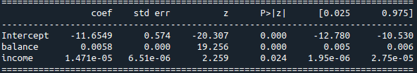

```{r setup, include=FALSE}
showsolA<-TRUE
showsolB<-TRUE
library(knitr)
opts_chunk$set(tidy.opts=list(width.cutoff=68),tidy=TRUE)
knitr::opts_chunk$set(echo = TRUE,tidy=TRUE,message=FALSE,warning=FALSE,strip.white=TRUE,prompt=FALSE,
                      cache=TRUE, size="scriptsize")
whichformat="latex"
```

--- 


# Plan for i dag

$~$

* Læringsmål og ressurser

* Hva er klassifikasjon 

* Trening, validering og testing (3 datasett)

* $k$-nærmeste nabo (KNN): en intuitiv metode

* Forvirringsmatrise og feilrate for å evaluere metoden

* Logistisk regresjon


---

# Læringsmål

* kunne forstå hva klassifikasjon går ut på og kjenne situasjoner der klassifikasjon vil være en
aktuell metode å bruke

* kjenne begrepene treningssett, valideringssett og testsett og forstå hvorfor vi lager dem og hva de skal brukes til

* vite hva en forvirringsmatrise er, og kjenne til begrepene
_feilrate_ (error rate) og _nøyaktighet_ (accuracy)

* forstå tankegangen bak $k$-nærmeste nabo-klassifikasjon, valg av k

* kjenne til modellen for logistisk regresjon, og kunne tolke
de estimerte koeffisientene

* forstå hvordan vi utfører klassifikasjon i Python

* kunne besvare oppgave 2 av prosjektoppgaven

--- 

# Læringsressurser

\vspace{2mm}


\vspace{2mm}


* **Kompendium**: Klassifikasjon (pdf og html, by Mette Langaas)

* **Korte videoer**: (by Mette Langaas)
  * Introduksjon og $k$-nærmeste nabo klassifiiasjon (10:58)
  * Logistisk regresjon (14:17)
 

* **Disse slides** med notater

---

# Klassifikasjon -- hva er det?

* Mål: 

  * tilordne en ny observasjon til en av flere _kjente_ klasser

  * lage en klassifikasjonsregel

  * estimere sannsynligheten for at en ny observasjon tilhører de ulike klassene
  
\vspace{2mm}

For hver av de uavhengige observasjonene $i=1,\ldots,n$ har vi

* Forklaringsvariabler $(x_{1i},x_{2i},\ldots,x_{pi})$
* En kategorisk responsvariablel $y_i$.

--- 

## Eksempler

\vspace{2mm}

* Hvilke tall er handskrevet på brev? Og hva er sannsynligheten for de ulike tallene (=klasser).
\vspace{2mm}

\centering
{width=50%}

\vspace{2mm}

\flushleft

* "Spam eller ham?" spam filer: Klassifikasjon om en e-post er spam eller ikke.  
Binær: Respons variable er "ja"/"nei" (1/0).
 
\vspace{2mm}

* Kommer en gitt kunde til å betale tilbake lånet sitt?

\vspace{2mm}


* Prognose om noen blir syk (hjertesykdom, kreft...) og sannsynligheten for det.


---

Noe om tilsvarende oppgave i prosjektet


---

## Syntetisk eksempel

$~$

* Et datasett med folgende struktur: $(x_{1i},x_{2i},y_i)$.
\vspace{2mm}

```{r,echo=FALSE,cache=TRUE,fig.width=5,fig.height=4,fig.align = "center",out.width='60%'}
library(mvtnorm)
library(caret)
library(MASS)
library(class)
library(dplyr)
library(ggpubr)
library(class)
library(gridExtra)

mu01=c(4,4)
mu02=c(1,2)
mu1=c(5,1)

sigma01=matrix(c(1,0.75,0.75,1),ncol=2)
sigma02=matrix(c(1,0,0,1),ncol=2)
sigma1=matrix(c(2,-0.5,-0.5,2),ncol=2)

n01=250
n02=250
n1=500
set.seed(4268)
x01=rmvnorm(n01,mu01,sigma01)
x02=rmvnorm(n02,mu02,sigma02)
x1=rmvnorm(n1,mu1,sigma1)
x01t=rmvnorm(n01,mu01,sigma01)
x02t=rmvnorm(n02,mu02,sigma02)
x1t=rmvnorm(n1,mu1,sigma1)

x1low=-0.9;x1high=7.9;x2low=-2.3;x2high=7.0

# data sets
permute <- sample(1:1000,replace=FALSE)

data.x=rbind(x01,x02,x1)
data.y=c(rep(0,n01+n02),rep(1,n1))
data.y=factor(data.y)

train.x <- data.x[permute[1:600],]
train.y <- data.y[permute[1:600]]

valid.x <- data.x[permute[601:800],]
valid.y <- data.y[permute[601:800]]

test.x <- data.x[permute[801:1000],]
test.y <- data.y[permute[801:1000]]


dataf=data.frame(x=data.x[,1], y=data.x[,2], klasse=as.character(data.y))
gg = ggplot(data=dataf) + 
  geom_point(aes(x=x, y=y, col=klasse,pch=klasse),size=2) + 
  ggtitle("")+xlab("x1")+ylab("x2") + theme_bw()


dataf=data.frame(x=train.x[,1], y=train.x[,2], klasse=as.character(train.y))

gg1 = ggplot(data=dataf) + 
  geom_point(aes(x=x, y=y, col=klasse,pch=klasse),size=2,show.legend = FALSE) + 
  ggtitle("Treningssettet")+xlab("x1")+ylab("x2") + theme_bw()
 

dataf=data.frame(x=valid.x[,1], y=valid.x[,2], klasse=as.character(valid.y))
gg2 = ggplot(data=dataf) + 
  geom_point(aes(x=x, y=y, col=klasse,pch=klasse),size=2,show.legend = FALSE) + 
  ggtitle("Valideringssettet")+xlab("x1")+ylab("x2") + theme_bw()
 

dataf=data.frame(x=test.x[,1], y=test.x[,2], klasse=as.character(test.y))
gg3 = ggplot(data=dataf) + 
  geom_point(aes(x=x, y=y, col=klasse,pch=klasse),size=2,show.legend = FALSE) + 
  ggtitle("Testsettet")+xlab("x1")+ylab("x2") + theme_bw()
 

gg
```

Spørsmål vi vil besvar: Hva vil beste klassifikasjonsgrense være?

---

## Et eksempel til

---

# Data

\vspace{2mm}

Datasett: $(x_{1i},x_{2i},\ldots, x_{pi},y_i)$

\vspace{2mm}

Vi må dele datasettet i tre deler:

\vspace{2mm}

* Treningsdata
* Valideringsdata
* Testdata

\vspace{5mm}


\vspace{2mm}
Hvorfor det?


---

# Trening-, validering- og testsett for syntetiske data

```{r,echo=FALSE,cache=TRUE,fig.width=10,fig.height=4,fig.align = "center",out.width='90%'}
grid.arrange( gg1, gg2, gg3, ncol = 3 )
```

---

# $k$-nærmeste-nabo-klassifikasjon

$~$

For å _finne_ klassifikasjonsreglen bruker vi bare treningsdataene.

$~$

Algoritmen:
  
  1) Ny observasjon: $x_0=(x_{1,0}, x_{2,0} , \ldots , x_{p,0})$ . Hvilken klasse bør denne klassifiseres til?

  2) Finn de $k$ nærmeste naboene til observasjonen i treningssettet.

  3) Sannsynligheten for at den nye observasjonen tilhører klasse 1 anslår vi er andelen av de k nærmeste
naboene som har tilhører klasse 1. Ditto for de andre klassene.

  4) Klassen til den nye observasjonen er den som har
størst sannsynlighet. Det blir det samme som å bruke
flertallsavstemming.

---

# $k$-nærmeste-nabo-klassifikasjon

\vspace{5mm}

Tre sp\oe rsm\aa l:
\vspace{5mm}

* Hva betyr "n\ae rmest"? Vi trenger en definision av avstand.

\vspace{1.5cm}

* Hvilke verdier kan $k$ ha?

\vspace{1.5cm}

* Hvordan bestemmer vi $k$?

---

## Hva betyr nærmest?

\vspace{2mm}

Nærmest er definert ved å bruke euklidsk avstand.

\centering
{width=40%}

\flushleft

Euklidsk avstand: $$D_E(i,0)=\sqrt{\sum_{j=1}^p (x_{ji}-x_{j0})^2 }$$

Andre avstandsm\aa l kan ogs\aa  \ brukes, men Euklidsk avstand er mest vanlig.

---

## N\ae rmeste naboer


\vspace{5mm}

```{r,echo=FALSE,cache=TRUE,fig.width=5,fig.height=4,fig.align = "center",out.width='60%'}

set.seed(123)
dataf=data.frame(x=train.x[1:20,1], y=train.x[1:20,2], klasse=as.character(train.y[1:20]))
gg = ggplot(data=dataf)
gg = gg + geom_point(aes(x=x, y=y, col=klasse,pch=klasse),size=2)
gg = gg + ggtitle("")+xlab("x1")+ylab("x2") + theme_bw()
gg
```


---

## N\ae rmeste naboer

\vspace{5mm}

```{r,echo=FALSE,cache=TRUE,fig.width=5,fig.height=4,fig.align = "center",out.width='60%'}
gg
```

---

## Tegn klassegrenser

\vspace{5mm}

```{r,echo=FALSE,cache=TRUE,fig.width=5,fig.height=4,fig.align = "center",out.width='60%'}
gg
```

---

## Hvordan ser klassegrensene ut?

$~$

Husk: Vi bruker treningssettet for å finne klassifikasjonsreglen:

$~$

```{r,echo=FALSE,cache=TRUE,fig.width=5,fig.height=4,fig.align = "center",out.width='70%'}
gg1
```

---

## Hvordan ser klassegrensene ut?

$~$
Svar: It depends!


```{r,knnplot,echo=FALSE,eval=TRUE,fig.width=7,fig.height=7,fig.align = "center",out.width='70%'}
#KNN
test.grid = expand.grid(x = seq(x1low,x1high,by=0.05), y=seq(x2low,x2high,by=0.05))
## k = 1
classif = class::knn(train.x, test=test.grid, cl=train.y, k=1, prob=TRUE)
prob = attr(classif, "prob")
dataf = bind_rows(mutate(test.grid, prob=prob, class="0", prob_cls=ifelse(classif==class, 1, 0)),
                  mutate(test.grid, prob=prob, class="1", prob_cls=ifelse(classif==class, 1, 0)))

gg1 = ggplot(dataf)+geom_point(aes(x=x, y=y, colour=class), data=mutate(test.grid, class=classif), size=0.01) + 
  geom_contour(aes(x=x, y=y, z=prob_cls, group=class, color=class), data=dataf, bins=2,size=0.5) + 
  ggtitle("k=1")+xlab("x1")+ylab("x2") + theme(legend.position = "none")

# k = 5

classif = class::knn(train.x, test=test.grid, cl=train.y, k=5, prob=TRUE)
prob = attr(classif, "prob")
dataf = bind_rows(mutate(test.grid, prob=prob, class="0", prob_cls=ifelse(classif==class, 1, 0)),
                  mutate(test.grid, prob=prob, class="1", prob_cls=ifelse(classif==class, 1, 0)))

gg5 = ggplot(dataf)+geom_point(aes(x=x, y=y, colour=class), data=mutate(test.grid, class=classif), size=0.01) +
  geom_contour(aes(x=x, y=y, z=prob_cls, group=class, color=class), data=dataf, bins=2,size=0.5) +
  ggtitle("k=5")+xlab("x1")+ylab("x2") + theme(legend.position = "none")

# k = 15

classif = class::knn(train.x, test=test.grid, cl=train.y, k=15, prob=TRUE)
prob = attr(classif, "prob")
dataf = bind_rows(mutate(test.grid, prob=prob, class="0", prob_cls=ifelse(classif==class, 1, 0)),
                  mutate(test.grid, prob=prob, class="1", prob_cls=ifelse(classif==class, 1, 0)))

gg15 = ggplot(dataf)+geom_point(aes(x=x, y=y, colour=class), data=mutate(test.grid, class=classif), size=0.01) + 
  geom_contour(aes(x=x, y=y, z=prob_cls, group=class, color=class), data=dataf, bins=2,size=0.5) + 
  ggtitle("k=15")+xlab("x1")+ylab("x2") + theme(legend.position = "none")

# k = 99

classif = class::knn(train.x, test=test.grid, cl=train.y, k=99, prob=TRUE)
prob = attr(classif, "prob")
dataf = bind_rows(mutate(test.grid, prob=prob, class="0", prob_cls=ifelse(classif==class, 1, 0)),
                  mutate(test.grid, prob=prob, class="1", prob_cls=ifelse(classif==class, 1, 0)))

gg99 = ggplot(dataf)+geom_point(aes(x=x, y=y, colour=class), data=mutate(test.grid, class=classif), size=0.01) +
  geom_contour(aes(x=x, y=y, z=prob_cls, group=class, color=class), data=dataf, bins=2,size=0.5) +
  ggtitle("k=99")+xlab("x1")+ylab("x2") + theme(legend.position = "none")

grid.arrange(gg1,gg5,gg15,gg99,nrow=2)
```

---

## Men vent... hvordan velger vi $k$ da?

$~$

Vi så jo at

* Vi skal ikke velge $k$ for liten, ellers blir grensen _for fleksibel_.

$~$

Men: 

* Vi skal antakeligvis heller ikke velge $k$ for stor, ellers kan bli _for ufleksibel_.

$~$

Det er noe som kalles en trade-off, og vi skal bruk valideringssettet for å få en ide om kvaliteten i klassifikasjonen.

---

## Forvirringsmatrise


Forvirringsmatrise med to klasser:

\vspace{4cm}

* **Feilrate**: andel feilklassifiserte observasjoner.

$~$

\centering
Derfor: Vi velger den $k$ som minimerer feilraten på _valideringssettet_ (ikke trainingssettet!).

---

Marker og tell antall gale klassifiseringer på valideringssettet ($k=1$):

```{r,knnplot2,echo=FALSE,eval=TRUE,fig.width=6,fig.height=6,fig.align = "center",out.width='70%'}

dataf.valid=data.frame(x=valid.x[,1], y=valid.x[,2], klasse=as.character(valid.y))

gg1.valid <- gg1 + geom_point(data=dataf.valid, aes(x=x, y=y, col=klasse,pch=klasse),size=2,show.legend = FALSE) +
  xlim(0,8) + ylim(-2.5,7.3)
 
gg1.valid
```

---

Igjen, men nå med $k=99$:


```{r,knnplot3,echo=FALSE,eval=TRUE,fig.width=6,fig.height=6,fig.align = "center",out.width='70%'}

dataf.valid=data.frame(x=valid.x[,1], y=valid.x[,2], klasse=as.character(valid.y))

gg99.valid <- gg99 +   geom_point(data=dataf.valid, aes(x=x, y=y, col=klasse,pch=klasse),size=2,show.legend = FALSE) +
  xlim(0,8) + ylim(-2.5,7.3)
 
gg99.valid
```

---

## Feilrate i valideringssettet

$~$

Det kan nå gjøres med alle $k=1,3,\ldots$, $k\leq n$. Det ser slik ut:

\vspace{5mm}

```{r,knn_validation,echo=FALSE,eval=TRUE,fig.width=5,fig.height=4,fig.align = "center",out.width='70%'}
kmax <- 101
misclas=numeric(length(seq(1,kmax,2)))
n = dim(valid.x)[1]
set.seed(9)
for(kk in 1:length(seq(1,kmax,2))){
  knn <- class::knn(train.x, test=valid.x, cl=train.y, k=kk, prob=TRUE)
  t = table(knn,valid.y)
  error = (n-sum(diag(t)))/n
  misclas[kk] = error
}


plot(seq(1,kmax,2),misclas,type="b",xlab="k",ylab="Feilrate",pch=19,cex=0.8)
```

--- 

Klassegrensene ser ganske likt ut for $k=15$ og $k=99$:

```{r,knnplot4,echo=FALSE,eval=TRUE,fig.width=7,fig.height=7,fig.align = "center",out.width='70%'}
grid.arrange(gg1,gg5,gg15,gg99,nrow=2)
```

---

# Data

\vspace{2mm}

Husk at vi hadde _tre_ deler i datasettet:

\vspace{2mm}

* **Treningssett**: For å lage en klassifikasjonsregel
* **Valideringssett**: For å finne på optimale hyperparametere
* **Testsett**: For å evaluere regelen på fremtidige data

\vspace{5mm}


\vspace{2mm}
Nå kan vi bruke testsettet for å finne feilraten.

---

Feilraten på testsettet for KNN med $k=15$ (egentlig er $k=31$ best, men det gjør ikke en stor forskjell): 


```{r,knnplot5,echo=FALSE,eval=TRUE,fig.width=7,fig.height=7,fig.align = "center",out.width='60%'}

# k = 15
dataf.test=data.frame(x=test.x[,1], y=test.x[,2], klasse=as.character(test.y))

gg15.test <- gg15 + geom_point(data=dataf.test, aes(x=x, y=y, col=klasse,pch=klasse),size=2,show.legend = FALSE) +
  xlim(0,8) + ylim(-2.5,7.3)
 
gg15.test
```

```{r,echo=FALSE,eval=TRUE}
classif = class::knn(train.x, test=test.x, cl=train.y, k=15, prob=TRUE)
t = table(classif,test.y)
error = (n-sum(diag(t)))/n
```

Feilraten er `r error`.


---

# $k$-nærmeste nabo klassifikasjon i Python

knaboer = np.arange(1,199,step=2)

val_feilrate = np.empty(len(knaboer))
for i,k in enumerate(knaboer):
  knn = KNeighborsClassifier(n_neighbors=k,p=2)
  knn.fit(df_tren[['x1','x2']], df_tren['y'])
  val_feilrate[i] = 1-knn.score(df_val[[‘x1','x2']], df_val['y'])


---

# Todo (adapt to the code they need in oppgave 2)

Plott feilrate:

`plt.title('k-NN for ulike verdier av antall naboer k')`  
`plt.plot(knaboer, val_feilrate, label='Feilrate på`  
 $~$ `valideringssettet')`  
`plt.xlabel('Antall naboer k'); plt.ylabel('Feilrate')`  
`plt.show()`

Velg k:

`mink_valfeilrate =`  
$~$ `knaboer[np.where(val_feilrate == val_feilrate.min())]`  
`print(mink_valfeilrate[0])`  

--- 

Sett opp klassifikator:

`bestek=99`  
`knn = KNeighborsClassifier(n_neighbors=bestek,p=2)`  

Feilrate på testsett: 

`knn.fit(df_tren[['x1','x2']], df_tren['y'])`  
`print("Feilrate kNN:", 1- knn.score(df_test[['x1','x2']], df_test['y']))`  


<!-- --- -->

<!-- ## Pensum for oppgave 2 -- hvor er vi nå? -->


<!-- \begin{multicols}{2} -->
<!-- \begin{itemize} -->
<!-- \item trening/validering/test -->
<!-- \item hvorfor -->
<!-- \item hvordan bruke -->
<!-- \item viktig å tenke på -->
<!-- \end{itemize} -->

<!-- \vspace{4mm} -->

<!-- \begin{itemize} -->
<!-- \item tolke plott -->
<!-- \item boksplott histogram -->
<!-- \item kryssplott korrelasjon -->
<!-- \item hva ser vi etter når vi vil lage en god klassifikasjonsregel? -->
<!-- \end{itemize} -->

<!-- \vspace{15mm} -->

<!-- \begin{itemize} -->
<!-- \item Forvirringsmatrise og feilrate -->
<!-- \item evaluere modell -->
<!-- \item velg mellom to modeller eller metoder -->
<!-- \item velge hyperparameter -->
<!-- \end{itemize} -->

<!-- \vspace{4mm} -->

<!-- \begin{itemize} -->
<!-- \item $k$-nærmeste nabo (kNN) -->
<!-- \item forstå metoden -->
<!-- \item velge $k$ -->
<!-- \end{itemize} -->

<!-- \vspace{4mm} -->

<!-- \begin{itemize} -->
<!-- \item logistisk regresjon -->
<!-- \item tolke estimerte koeffisienter -->
<!-- \item hypotesetest og p-verdi -->
<!-- \item velge mellom modeller -->
<!-- \end{itemize} -->
<!-- \end{multicols} -->

<!-- --- -->


# Plan for i dag

$~$

* Læringsmål og ressurser

* Hva er klassifikasjon 

* Trening, validering og testing (3 datasett)

* $k$-nærmeste nabo (kNN): en intuitiv metode

* Forvirringsmatrise og feilrate for å evaluere metoden

* Logistisk regresjon

---

# Logistisk regresjon

$~$

* Kan bare handtere _to klasser_ $y_i \in \{0,1\}$.

$~$

* Vi antar at $Y_i$ har en **Bernoulli fordeling** med suksessannsynlighet $p_i$, derfor:

$$y_i = \begin{cases} 1 \text{ med sannsynlighet } p_i, \\ 0 \text{ med sannsynlighet } 1-p_i. \end{cases}$$

$~$

* **Mål**: For forklaringsvariabler $(x_{1i},x_{2i},\ldots,x_{pi})$ vi vil estimere $p_i = \text{Pr}(y_i=1 \mid x_1,\ldots,x_p)$.

---

## Eksempel: Kredittkort data

\vspace{2mm}

Datasettet `Default` er tatt fra her: https://rdrr.io/cran/ISLR/man/Credit.html

\vspace{2mm}
**Mål** : forutsi om en person ikke betaler kredittkortregning ("person defaults"), avhengig av årsinntekten (income) og balansen på kredittkortet (balance).

\textcolor{orange}{Orange: default=yes}, \textcolor{blue}{blue: default=no}.


 \centering
{width=50%}

---

Det ser ut som at "Balance" er en ganske god forklarende variabel til Default (nei/ja).

$~$

```{r, echo=F,fig.width=8,fig.height=3.7,fig.align = "center",out.width='95%'}
library(ISLR)
data(Default)
Default$default.bin <- as.numeric(Default$default)-1
g1 <- ggplot(Default, aes(x =balance,fill=default,color=default)) +
  geom_density(size = 1.5,alpha=0.6)
g2 <- ggplot(Default, aes(x =income,fill=default,color=default)) +
  geom_density(size = 1.5,alpha=0.6)

grid.arrange(g1, g2, ncol=2 )
```


---

## Kan vi bare bruke linear regresjon for binær klassifikasjon?
\vspace{1mm}

For en binær responsvariabel $Y =$ `yes` or `no`, og forklaringsvariabler $X$ bruker vi vannligvis en _dummy encoding_ :

$$Y = \left\{ \begin{array}{ll}
0 & \text{if } \texttt{no} \ , \\
1 & \text{if } \texttt{yes} \ .
\end{array} \right.$$

\vspace{6mm}

```{r, echo=F,fig.width=6,fig.height=5,fig.align = "center",out.width='60%'}
 
plot(default.bin ~ balance,data=Default,xlab="Balanse",ylab="Default (0/1)",col="orange")

```


---

* Kunne vi da ikke bare formulere en linear regresjonsmodell for $Y$ vs. $X$? 

* Vi kunne jo klassifisere response som "ja" (1) hvis $\hat{Y}> 0.5$.

\vspace{2mm}


* Problemet med linear regresjon: Vi kan forutsi $Y<0$ eller $Y>1$ med modellen, men en sannsynlighet er alltid mellom 0 og 1.

$~$

For kredittortdatasettet:
\vspace{-2mm}


 

---

## Vi trenger logistisk regresjon!

$~$

```{r, echo=F,fig.width=7,fig.height=5.5,fig.align = "center",out.width='80%'}
r.glm <- glm(default.bin~balance,Default,family="binomial") 
coefs <- summary(r.glm)$coef[,1]

xx <- seq(0,2700)
eta <- coefs[1] + coefs[2]*xx
probs <- exp(eta)/(1+exp(eta))

plot(default.bin ~ balance,data=Default,xlab="Balanse",ylab="Sannsynlighet for Default",col="orange")
lines(xx,probs,type="l",col=4,lwd=3)
```


---

## Enkel logistisk regresjon

$~$

* Vi antar at responsen $Y_i$ er binomisk fordelt med suksessannsynlighet $p_i$

$~$

* **Ideen**: å koble $p_i$ sammen med forklaringsvariablen med en logistisk funksjon:

$$p_i = \frac{\exp(\beta_0 + \beta_1 x_{1i})}{1+ \exp(\beta_0 + \beta_1 x_{1i})} \ .$$

I kredittkorteksempelet er $x_{1i}$ balansen til person $i$.

---

## Klassifikasjonsregel

$~$

$p\geq 0.5$ vs $p<0.5$:

$~$

```{r, echo=F,fig.width=7,fig.height=5.5,fig.align = "center",out.width='80%'}
r.glm <- glm(default.bin~balance,Default,family="binomial") 
coefs <- summary(r.glm)$coef[,1]

xx <- seq(0,2700)
eta <- coefs[1] + coefs[2]*xx
probs <- exp(eta)/(1+exp(eta))

plot(default.bin ~ balance,data=Default,xlab="Balanse",ylab="Sannsynlighet for Default",col="orange")
lines(xx,probs,type="l",col=4,lwd=3)
abline(h=0.5,lty=2)
abline(v=1937,lty=2)
text(x=2240,y=0.2,labels="Balanse=1937")
```

---

## Enkel logistisk regresjon med Python

$~$


---

## Tolkning av $\beta_1$: odds

$~$

* Odds er definert som ratioen mellom sannsynlighet for suksess ($p$) og fiasko ($1-p$): 
$$odds = \frac{p}{1-p}$$

$~$

* Noen eksempler:

$~$

$~$

* I logistisk regresjon: Hvis vi øker verdien til kovariaten fra $x_{i1}$ til $x_{i1} + 1$ så blir
den nye oddsen lik den gamle multiplisert med $e^{\beta_1}$.


---

## Enkel logistisk regresjon  

$~$


$~$

$~$

* $\beta_0=-11.0385$, $\beta_1=0.0057$.

\vspace{3mm}

* $e^{0.0057}=1.0057$: Hvis `balance` øker med 1, går odds opp en _faktor_ 1.0057. 

\vspace{3mm}

* $e^{0.0057\cdot 100}=1.768$: Hvis `balance` øker med 100, går odds opp en _faktor_ 1.769.

\vspace{3mm}

* Husk at $H_0: \beta_1=0$ versus $H_1: \beta_1\neq 0$. Her vi har $p<0.001$ for testen, derfor forkaster vi $H_0$.


\vspace{10mm}

---

## Logistisk regresjon med flere forklaringsvariabler

$~$



$~$

* Nytt: $$p_i = \frac{\exp(\beta_0 + \beta_1 x_{1i} + \beta_2 x_{2i})}{ 1 + \exp(\beta_0 + \beta_1 x_{1i} + \beta_2 x_{2i})}$$

\vspace{2mm}

* Tolkning av $\beta_1$ og $\beta_2$?

\vspace{2mm}

* $p$-verdi?

---

## Hvilken modell er bedre?

$~$

* For klassifikasjonen, skal vi velge modellen med bare `balance` eller med `balance + income`?

$~$

* Ideen: Skjekk feilrate på valideringssettet!

$~$

* Husker du bruk av forvirringsmatrise?

$~$

* Det har jeg gjort: 
    * Enkelt modell: 0.031
    * Multipel modell: 0.0295


---

## Python code

$~$

`formel='y ~ balance + income'`  
`modell = smf.logit(formel,data=df)`  
`resultat = modell.fit()`  
`resultat.summary()`  
`print(np.exp(resultat.params))` 

$~$

`cutoff = 0.5`  
`test_pred = resultat.predict(exog = df_test)`  
`y_testpred = np.where(test_pred > cutoff, 1, 0)`  
`y_testobs = df_test['y']`  
`print("Feilrate:", 1-accuracy_score(y_true=y_testobs,`  
  $~$ `y_pred=y_testpred,normalize=True))`