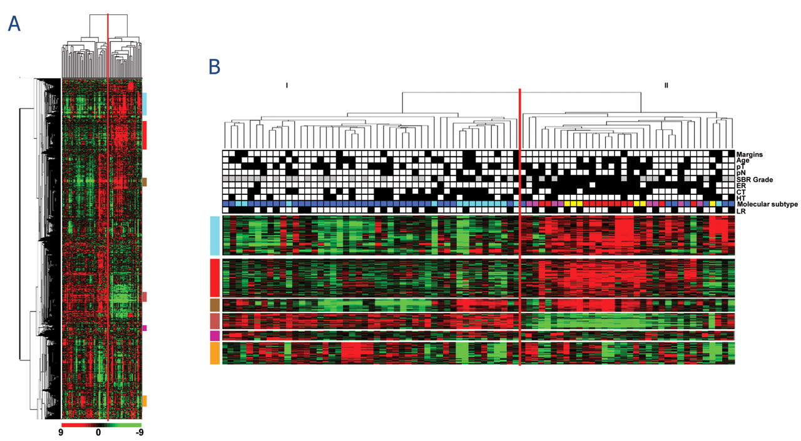
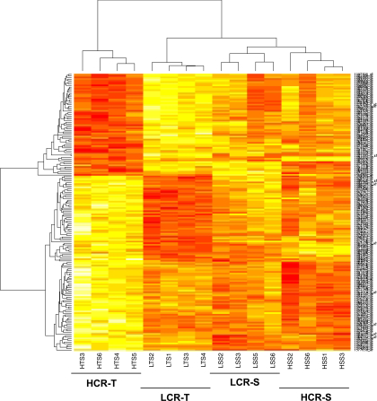
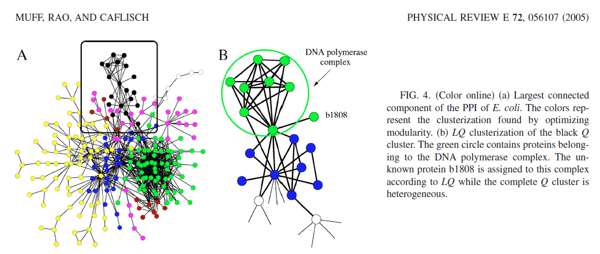

```{r setup, include=FALSE}
showsolA<-TRUE
showsolB<-TRUE
library(knitr)
opts_chunk$set(tidy.opts=list(width.cutoff=68),tidy=TRUE)
knitr::opts_chunk$set(echo = TRUE,tidy=TRUE,message=FALSE,warning=FALSE,strip.white=TRUE,prompt=FALSE,
                      cache=TRUE, size="scriptsize")
whichformat="latex"
```

--- 

# Plan for i dag

$~$

* Hva er klyngeanalyse 

* Læringsmål, pensum og læringsressurser

* Avstandsmål

* K-gjennomsnitt ("K-means") klyngeanalyse

* Bruk av klyngeanalyse på et bilde (prosjektet fra i fjor)

* Hierarkisk klyngeanalyse
 
* Informasjon om prosjektet


---

# Eksempel 1: Genaktivitet


* $n=81$ celleprøver fra kreftsvulster til ulike pasienter

* genaktivitet for $p =12957$ gener


\vspace{2mm}

**Spørsmål:**

Hvilke celleprøver fra brystkreftpasienter ligner hverandre mest?  

Kan vi finne ukjente klynger (av celleprøver) i dataene? 

Dette kan hjelpe for å forutsi sannsynlighet for en tilbakefall.

---

\centering
{width=90%}
<!-- {width=60%}  -->
$$ X = p\times n  =  \text{gener} \times \text{prøver}  \ .$$


\tiny
Finn ut mer:
<https://cgp.iiarjournals.org/content/8/4/199>

---

# Eksempel 2: Proteininteraksjonsnettwerk

 Kan vi finne klynger med relatert funksjon?




---

# Læringsmål

* forstå hvorfor det er interessant å gjøre klyngeanalyse

* kjenne igjen situasjoner der klyngeanalyse vil være en aktuell metode å bruke

* kjenne begrepene avstandsmål, koblingstype, dendrogram

* forstå algoritmen for å utføre K-gjennomsnitt-klyngeanalyse og hierarkisk klyngeanalyse

* forstå hvordan klyngeanalyse utføres i Python

*  kunne besvare oppgave 3 av prosjektoppgaven på en god måte!

--- 

# Læringsressurser

\vspace{2mm}

$~$

Tema Klyngeanalyse:

\vspace{2mm}


* **Kompendium**: Klyngeanalyse (pdf og html, by Mette Langaas)

* **Korte videoer**: (by Mette Langaas)
  * Klyngeanalyse (8:43 min)
  * Hierarkisk klyngeanalyse (11:26 min)
  * K-gjennomsnitt-klyngeanalyse (8:38 min)
 
* Denne forelesningen

* **Disse slides** med notater

$~$

https://wiki.math.ntnu.no/istx1003/2021h/start

---

# Klyngeanalyse -- hva er det?

* Mål: 

  * tilordne en ny observasjon til en av flere _kjente_ klasser

  * lage en klassifikasjonsregel

  * estimere sannsynligheten for at en ny observasjon tilhører de ulike klassene
  
\vspace{2mm}

For hver av de uavhengige observasjonene $i=1,\ldots,n$ har vi

* Forklaringsvariabler $(x_{1i},x_{2i},\ldots,x_{pi})$
* En kategorisk responsvariablel $y_i$.

--- 

## Eksempler


