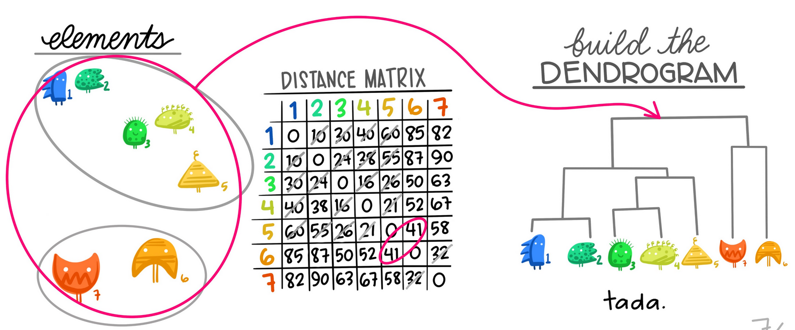

```{r setup, include=FALSE}
showsolA<-TRUE
showsolB<-TRUE
library(knitr)
opts_chunk$set(tidy.opts=list(width.cutoff=68),tidy=TRUE)
knitr::opts_chunk$set(echo = TRUE,tidy=TRUE,message=FALSE,warning=FALSE,strip.white=TRUE,prompt=FALSE,
                      cache=TRUE, size="scriptsize")
whichformat="latex"
```

--- 

# Plan for i dag

$~$

* Hva er klyngeanalyse 

* Læringsmål, pensum og læringsressurser

* Avstandsmål

* K-gjennomsnitt ("K-means") klyngeanalyse

* Bruk av klyngeanalyse på et bilde (prosjektet fra i fjor)

* Hierarkisk klyngeanalyse
 
* Informasjon om prosjektet


---

# Eksempel 1: Genaktivitet


* $n=81$ celleprøver fra kreftsvulster til ulike pasienter

* genaktivitet for $p =12957$ gener


\vspace{2mm}

**Spørsmål:**

Hvilke celleprøver fra brystkreftpasienter ligner hverandre mest?  

Kan vi finne ukjente klynger (av celleprøver) i dataene? 

Dette kan hjelpe for å forutse sannsynligheten for en tilbakefall.

---

\centering
{width=90%}
<!-- {width=60%}  -->
$$ X = p\times n  =  \text{gener} \times \text{prøver}  \ .$$


\tiny
Finn ut mer:
<https://cgp.iiarjournals.org/content/8/4/199>

---

# Eksempel 2: Proteininteraksjonsnettwerk

 Kan vi finne klynger med relatert funksjon?


---

# Eksempel 3: Bildanalyse

Det var en prosjektoppgave i fjor.

Mål:

Å bruke klyngeanalyse til å fjerne detaljer og støy - ved å
dele pikslene inn i to eller flere klynger.

Todo: Ev adapt with task from this year.


---

# Læringsmål

* forstå hvorfor det er interessant å gjøre klyngeanalyse

* kjenne igjen situasjoner der klyngeanalyse vil være en aktuell metode å bruke

* kjenne begrepene avstandsmål, koblingstype, dendrogram

* forstå algoritmen for å utføre K-gjennomsnitt-klyngeanalyse og hierarkisk klyngeanalyse

* forstå hvordan klyngeanalyse utføres i Python

*  kunne besvare oppgave 3 av prosjektoppgaven på en god måte!

--- 

# Læringsressurser

\vspace{2mm}

$~$

Tema Klyngeanalyse:

\vspace{2mm}


* **Kompendium**: Klyngeanalyse (pdf og html, by Mette Langaas)

* **Korte videoer**: (by Mette Langaas)
  * Klyngeanalyse (8:43 min)
  * Hierarkisk klyngeanalyse (11:26 min)
  * K-gjennomsnitt-klyngeanalyse (8:38 min)
 
* Denne forelesningen

* **Disse slides** med notater

$~$

Som alltid se her:

https://wiki.math.ntnu.no/istx1003/2021h/start

---

# Klyngeanalyse -- hva er det?

Vi har data
$$X : n\times p$$
men _ikke_ noen respons $Y$. _\textcolor{red}{Ikke-veiledet = unsupervised}_

\vspace{4mm}

**Mål:**

 * Finn ukjente klynger i dataene.
 * Observasjoner innen hver klynge er mer lik hverandre enn observasjoner fra ulike klynger.

\vspace{2mm}

**Hva skal vi bruke resultatene fra klyngeanalysen til?**

* Bildet: Fjerne støy eller, spare lagringsplass
* Medisin: Finne subgrupper av en sykdom $\rightarrow$ relevant for behandling?

\vspace{2mm}


---

# Klyngeanalyse -- hva er det?

**Generelt**: Finne _\textcolor{red}{struktur}_ i dataene.

\vspace{6mm}

Kan vi stole på resultatene? Hvor robuste er de?

$\rightarrow$ Fortsatt et forskningsområde!

--- 

# Avstandsmål 

Før en klyngeanalyse må vi først definere en _avstand_ mellom to datapoeng. 

To populære avstandsmal:

**Euklidsk** \hspace{4cm} **City-block (=Manhattan)**

{width=48%}
{width=50%}


---

**Euklidsk** \hspace{4cm} **City-block (=Manhattan)**

$$D_E(i,i') = \sqrt{\sum_{j=1}^p (x_{ji} - x_{ji'})^2} \qquad \quad D_M(i,i') =  \sum_{j=1}^p |x_{ji} - x_{ji'}|$$


$~$

Avstandsmål i mer enn 2 dimensioner: Enkelt å regne, men litt vanskelig å forestille seg.

---

# Metoder for klyngeanalyse

Det fins ganske mange metoder, men vi ser på to som er (mest?) populær:

**K-gjennomsnitt klyngeanalyse**

\centering
{width=50%}


\flushleft
**Hierarkisk klyngeanalyse**

\centering
{width=55%}

\tiny Artwork by @allison_horst

---

## K-gjennomsnitt klyngeanalyse

$~$

* Finn $K$ ukjente klynger i dataene.

\vspace{2mm}

\centering
```{r, echo=FALSE,fig.width=4,fig.height=3.5,out.width='50%'}
library(ggplot2)
df <- data.frame(x1 = c(18, 21, 22, 24, 26, 26, 27, 30, 31, 35, 39, 40, 41, 42, 44, 46, 47, 48, 49, 54),
    x2 = c(10, 11, 22, 15, 12, 13, 14, 33, 39, 37, 44, 27, 29, 20, 28, 21, 30, 31, 23, 24)
)
ggplot(df, aes(x = x1, y = x2)) +
    geom_point()
```

* Alle observasjoner skal være medlem i akkurat en klynge
* Variasjonen innen hver klynge skal være så liten som mulig

---

## Variasjon innen en klynge $k$

$~$

* $K$ klynger $C_1, \ldots, C_k, \ldots, C_K$. 

* Antall observasjoner i klynge $k$: $|C_k|$.

* Variasjon in klynge $k$: 
$$\frac{1}{|C_k|} \sum_{i,i'\in C_k}\sum_{j=1}^p (x_{ij}-x_{i'j})^2$$

$~$

**Optimeringsproblem**

Vi vil _minimere_ variasjon over _alle klynger_: 
$$\sum_{k=1}^K\frac{1}{|C_k|} \sum_{i,i'\in C_k}\sum_{j=1}^p (x_{ij}-x_{i'j})^2$$

---

Nyttig sammenhang som er grunnlag for $k$-gjennomsnitt algoritme

$$\sum_{k=1}^K\frac{1}{|C_k|} \sum_{i,i'\in C_k}\sum_{j=1}^p (x_{ij}-x_{i'j})^2$$

$$ = \sum_{k=1}^K 2 \sum_{i\in C_k}\sum_{j=1}^p (x_{ij}-\overline{x}_{kj})^2\ ,$$
$~$

med _klyngesentroide_ i klynge $k$: $\overline{x}_k = (\overline{x}_{k1}, \ldots, \overline{x}_{kp})$

---

## K-gjennomsnitt algoritme

$~$

* Start med å velge antall klynker $K$.

\vspace{2mm}

* Tilordne hver observasjon til en klynge

  * Mange muligheter
      + tilfeldig velge ut $K$ observasjoner og sette disse som klyngesentroider
      + tilfeldig klynger
  * og deretter tilordne der resterende observasjoner til klyngen med nærmeste klyngesentroide.
  
\vspace{2mm}

* \textcolor{red}{Repeter} (iterativt) _til ingen observasjoner endrer klyngemedlemskap_:
  1. For hver klynge regn ut klyngesentroiden
  2. Tilordne hver observasjon til klyngen til nærmeste klyngesentroide
  
---

## Illustrasjon av $K$-gjennomsnitt algoritme ($K=3$)

\centering
{width=70%}
  
\scriptsize
Fig. 10.6 fra "An Introduction to Statistical
  Learning with Applications in R", James et al 2013.
  
---

## $K$-gjennomsnitt-algoritmen i Python

Todo

---

## Prosjektoppgaven

Todo

---

# Hierarkisk klyngeanalyse

$~$
 
{width=80%}

\tiny Artwork by @allison_horst 


---

## Eksempel

$~$

$n=5, p=2$

$~$

{width=25%}
{width=65%}


<!-- ```{r exampleplot, echo=FALSE,fig.width=4,fig.height=3.5,out.width='40%'} -->
<!-- library(ggplot2) -->
<!-- df <- data.frame(x1 = c(1,2,4,7,5), -->
<!--     x2 = c(1,1,5,7,7),name=c("a","b","c","d","e") -->
<!-- ) -->
<!-- ggplot(df, aes(x = x1, y = x2,label=name)) + -->
<!--     geom_point(size=2) + -->
<!--     geom_text(aes(label=name),hjust=-1.2, vjust=0) + -->
<!--   scale_x_continuous(limits = c(1,7.5)) + -->
<!--   scale_y_continuous(limits = c(0,8)) -->
<!-- ``` -->

<!-- ```{r, echo=FALSE} -->
<!-- kable(df) -->
<!-- ``` -->


---

{width=25%}
{width=65%}

1) Velg avstandsmål
2) Regn ut avstanden mellom alle par av observasjoner
3) Plasser avstandene inn i en $n\times n$ matrise


---

## Avstandsmatrise (Euklidsk avstand)

$~$

{width=50%}

```{r,echo=FALSE}
df2 <- data.frame(name=c("a","b","c","d","e"), 
                 a = c(0,1,5.0,8.5,7.2), 
                 b= c(1,0,4.5,7.8,6.7),
                 c = c(5.0,4.5, 0,3.6,2.2),
                 d = c(8.5,7.8,3.6,0,2.0),
                 e = c(7.2,6.7,2.2,2.0,0))
                  
kable(df2,digits=1,align="c")
```


---

## Avstand mellom klynger?